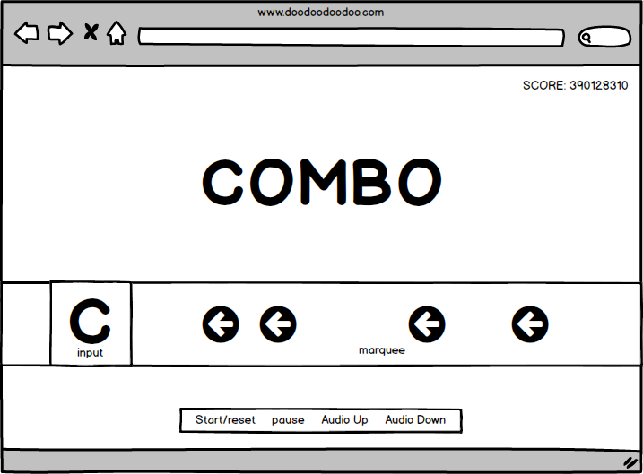

## Tony's game of Lyrics Hero

### Background

Lyrics Hero is a precision timing and typing game.  Players will type the first letter of the word that comes up in the song as it's being played.  The letters will scroll from the right side of the screen to the left.  Once the letter reaches the input box, the player should type that letter.

The rules are simple:

1) Type the letter when the letter reaches the input box.
2) The longer your streak the more points you get.
3) Feel like badass DJ!!!

### Functionality & MVP  

Lyrics Hero will offer the following game options:

- [ ] Start, pause, and reset buttons.
- [ ] A score counter.
- [ ] A scrolling marquee to show the upcoming keys.
- [ ] Audio playback for a selection of songs.
- [ ] A variety of visual effects based on how well the player is doing.

In addition, this project will include:

- [ ] An About modal describing the background and rules of the game
- [ ] A production Readme

### Wireframes

The game will have Start/Pause/Reset options.  Once the game has started the player will be using the keyboard to type letters that scroll from the right to the left of the screen.

### Architecture and Technologies

This project will be implemented with the following technologies:

- Vanilla JavaScript
- `HTML5 Canvas` for DOM manipulation and rendering,
- Webpack to bundle and serve up the various scripts.

Most of the DOM elements of the website will be generated dynamically using Vanilla Java.  HTML5 Canvas will be used to enhance visual effects and transitions.  On top of that, webpack will be implemented to keep the development.

### Implementation Timeline

**Day 1**: Setup webpack and upload the basic site onto Heroku.  Setup a modal page to load the game configurations. Brush up on CSS and canvas techniques for visual effects in the game. Start building game features on day 2.

**Day 2**: Building out the basic game components so a playable game is present.
- Audio playback
- Scrolling marquee of letters
- Scoring of keying accuracy, just binary results at first, If the user types within 500ms before or after the correct timing.

**Day 3**: Add start, pause and reset controls.  Fine tune the accuracy of scoring and load songs for actual gameplay.  Start attaching visual effect to event handlers. Visual effects should be attached to:
- correct/incorrect typing
- combo breakpoints
- start/end of the game

**Day 4**: Bump up visual effects and components.  The visual effects are the main goal of the project so they should look very polished.

### Bonus features

More, more, more visual effects. Other game modes like easy mode, or brutal modes.
